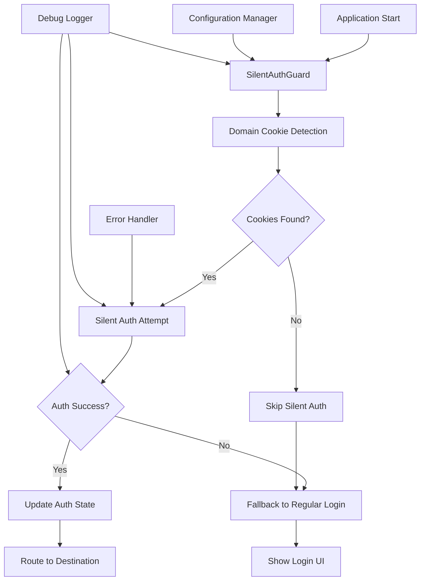

# Design Document

## Overview

This design enhances the existing Kinde silent authentication system to provide seamless cross-subdomain authentication using Kinde's custom domain functionality. The solution builds upon the current `useSilentAuth` hook, `SilentAuthGuard`, and `SilentLoginButton` components while adding improved domain cookie detection, enhanced error handling, and better configuration management.

## Architecture

### Current State Analysis

The existing implementation includes:
- `useSilentAuth` hook for silent authentication logic
- `SilentAuthGuard` component for app-level authentication checks
- `SilentLoginButton` for enhanced login experience
- Basic domain cookie detection
- Kinde integration with custom domain support

### Enhanced Architecture



## Components and Interfaces

### 1. Enhanced Configuration Management

**Interface: `SilentAuthConfig`**
```typescript
interface SilentAuthConfig {
  customDomain: string;
  cookieNames: string[];
  timeout: number;
  debugMode: boolean;
  fallbackEnabled: boolean;
  organizationSupport: boolean;
}
```

**Component: `ConfigurationManager`**
- Reads environment variables
- Validates configuration
- Provides runtime configuration access
- Handles different environments (dev, staging, prod)

### 2. Enhanced Domain Cookie Detection

**Component: `DomainCookieDetector`**
- Improved cookie detection logic
- Support for multiple cookie patterns
- HttpOnly cookie awareness
- Cross-subdomain cookie validation

**Methods:**
- `detectKindeCookies(): boolean`
- `validateCookieScope(domain: string): boolean`
- `getCookieMetadata(): CookieInfo[]`

### 3. Enhanced Silent Authentication Hook

**Enhanced `useSilentAuth` Hook**
- Improved error handling and retry logic
- Better timeout management
- Organization context support
- Enhanced debugging capabilities

**New Methods:**
- `checkDomainCookies(): Promise<boolean>`
- `attemptSilentAuthWithRetry(): Promise<boolean>`
- `validateAuthState(): Promise<AuthValidationResult>`

### 4. Enhanced Authentication Guard

**Enhanced `SilentAuthGuard` Component**
- Better initialization flow
- Improved loading states
- Enhanced error boundaries
- Organization-aware routing

### 5. Debug and Testing Interface

**Component: `SilentAuthDebugPanel`**
- Real-time authentication status
- Cookie inspection tools
- Manual authentication testing
- Configuration validation
- Network request monitoring

## Data Models

### Authentication State Model
```typescript
interface EnhancedAuthState {
  isAuthenticated: boolean;
  isLoading: boolean;
  hasValidCookies: boolean;
  silentAuthAttempted: boolean;
  silentAuthSuccess: boolean;
  lastAuthCheck: Date;
  organizationContext?: string;
  errors: AuthError[];
  debugInfo: DebugInfo;
}
```

### Cookie Information Model
```typescript
interface CookieInfo {
  name: string;
  domain: string;
  secure: boolean;
  httpOnly: boolean;
  sameSite: string;
  expires?: Date;
  isKindeRelated: boolean;
}
```

### Configuration Model
```typescript
interface RuntimeConfig {
  kindeDomain: string;
  clientId: string;
  customDomain: string;
  subdomains: string[];
  cookieSettings: CookieSettings;
  timeouts: TimeoutSettings;
  debugMode: boolean;
}
```

## Error Handling

### Error Categories

1. **Configuration Errors**
   - Missing environment variables
   - Invalid domain configuration
   - SSL/HTTPS issues

2. **Network Errors**
   - Timeout during silent auth
   - Network connectivity issues
   - CORS problems

3. **Authentication Errors**
   - Invalid or expired tokens
   - Insufficient permissions
   - Organization access denied

4. **Cookie Errors**
   - Missing domain cookies
   - Invalid cookie format
   - Cross-domain cookie issues

### Error Recovery Strategies

1. **Graceful Degradation**
   - Fall back to regular login flow
   - Maintain user experience
   - Clear error messaging

2. **Retry Logic**
   - Exponential backoff for network errors
   - Limited retry attempts
   - Circuit breaker pattern

3. **User Feedback**
   - Clear error messages
   - Actionable recovery steps
   - Debug information for developers

## Testing Strategy

### Unit Testing

1. **Hook Testing**
   - Test `useSilentAuth` hook with various scenarios
   - Mock Kinde authentication responses
   - Test error conditions and edge cases

2. **Component Testing**
   - Test `SilentAuthGuard` initialization flow
   - Test `SilentLoginButton` behavior
   - Test error boundary functionality

3. **Utility Testing**
   - Test cookie detection logic
   - Test configuration validation
   - Test error handling utilities

### Integration Testing

1. **Authentication Flow Testing**
   - End-to-end silent authentication
   - Cross-subdomain authentication
   - Organization-specific authentication

2. **Error Scenario Testing**
   - Network failure scenarios
   - Invalid configuration testing
   - Cookie manipulation testing

### Manual Testing

1. **Cross-Subdomain Testing**
   - Test authentication across different subdomains
   - Verify cookie sharing behavior
   - Test organization context preservation

2. **Browser Compatibility Testing**
   - Test across different browsers
   - Verify cookie behavior consistency
   - Test HTTPS requirements

### Debug Testing Interface

1. **Real-time Monitoring**
   - Authentication state visualization
   - Cookie inspection tools
   - Network request monitoring

2. **Manual Testing Tools**
   - Force silent authentication attempts
   - Clear authentication state
   - Simulate error conditions

## Implementation Phases

### Phase 1: Configuration Enhancement
- Implement enhanced configuration management
- Add environment variable validation
- Create configuration debugging tools

### Phase 2: Cookie Detection Improvement
- Enhance domain cookie detection logic
- Add support for multiple cookie patterns
- Implement cookie validation utilities

### Phase 3: Authentication Flow Enhancement
- Improve silent authentication retry logic
- Add better timeout handling
- Implement organization context support

### Phase 4: Error Handling and Debugging
- Implement comprehensive error handling
- Add debug panel and testing interface
- Create detailed logging system

### Phase 5: Testing and Validation
- Implement comprehensive test suite
- Add cross-browser testing
- Create manual testing procedures

## Security Considerations

1. **Cookie Security**
   - Ensure HttpOnly cookies are properly handled
   - Validate Secure flag requirements
   - Implement SameSite cookie policies

2. **Token Validation**
   - Validate tokens on both client and server
   - Implement token refresh logic
   - Handle token expiration gracefully

3. **Cross-Domain Security**
   - Validate subdomain access
   - Implement proper CORS policies
   - Ensure secure cookie sharing

4. **Error Information Disclosure**
   - Limit sensitive information in error messages
   - Implement secure logging practices
   - Protect debug information in production

## Performance Considerations

1. **Initialization Performance**
   - Minimize silent authentication delay
   - Implement efficient cookie detection
   - Optimize component rendering

2. **Memory Management**
   - Proper cleanup of event listeners
   - Efficient state management
   - Minimize re-renders

3. **Network Optimization**
   - Implement request caching
   - Minimize redundant authentication checks
   - Optimize timeout values

## Monitoring and Analytics

1. **Authentication Metrics**
   - Silent authentication success rates
   - Authentication failure reasons
   - Performance metrics

2. **Error Tracking**
   - Error frequency and types
   - User impact analysis
   - Recovery success rates

3. **Usage Analytics**
   - Cross-subdomain usage patterns
   - Organization-specific metrics
   - Browser compatibility data