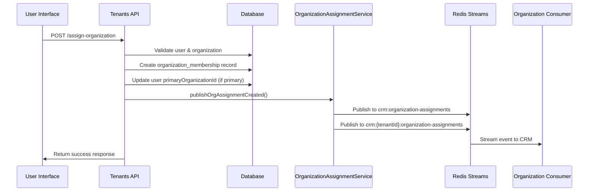
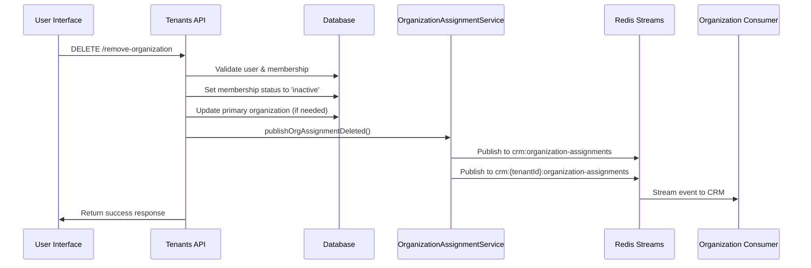

# Organization Assignment Events Integration

This document describes how organization assignment events are published to Redis Streams when users are assigned to organizations and removed from organizations within the Wrapper application.

## Overview

Organization assignments in the Wrapper application trigger real-time events that are published to Redis Streams for consumption by external CRM systems and other microservices. This enables seamless synchronization of user-organization relationships across the entire business suite.

## Event Types

### Organization Assignment Created
Published when a user is assigned to an organization.

**Event Type:** `organization.assignment.created`

**Stream:** `crm:organization-assignments`

**Trigger:** POST `/api/tenants/current/users/:userId/assign-organization`

### Organization Assignment Updated
Published when an organization assignment is modified (e.g., access level, primary status changes).

**Event Type:** `organization.assignment.updated`

**Stream:** `crm:organization-assignments`

**Trigger:** PUT `/api/tenants/current/users/:userId/update-organization`

### Organization Assignment Deactivated
Published when an organization assignment is deactivated.

**Event Type:** `organization.assignment.deactivated`

**Stream:** `crm:organization-assignments`

**Trigger:** DELETE `/api/tenants/current/users/:userId/remove-organization` (sets status to 'inactive')

### Organization Assignment Activated
Published when an inactive organization assignment is reactivated.

**Event Type:** `organization.assignment.activated`

**Stream:** `crm:organization-assignments`

**Trigger:** PUT `/api/tenants/current/users/:userId/update-organization` (changes status to 'active')

### Organization Assignment Deleted
Published when an organization assignment is permanently deleted.

**Event Type:** `organization.assignment.deleted`

**Stream:** `crm:organization-assignments`

**Trigger:** DELETE `/api/tenants/current/users/:userId/remove-organization` (permanent removal)

## Event Structure

### Base Event Format

```json
{
  "eventId": "string (UUID)",
  "eventType": "organization.assignment.{action}",
  "source": "wrapper-app",
  "version": "1.0",
  "timestamp": "ISO 8601 datetime string",
  "tenantId": "string (UUID)",
  "data": {
    // Assignment-specific data (see below)
  }
}
```

### Assignment Data Structure

```json
{
  "assignmentId": "string (UUID or generated ID)",
  "userId": "string (UUID)",
  "organizationId": "string (UUID)",
  "organizationCode": "string",
  "assignmentType": "direct|inherited|temporary",
  "accessLevel": "admin|manager|standard|limited",
  "isActive": "boolean",
  "isPrimary": "boolean",
  "assignedAt": "ISO 8601 datetime string",
  "priority": "integer (1-10)",
  "assignedBy": "string (UUID of user who performed assignment)",
  "metadata": "object (optional additional data)"
}
```

### Update Event Additional Fields

For update events, additional fields are included:

```json
{
  "changes": {
    "membershipType": "string (new value)",
    "accessLevel": "string (new value)",
    "isPrimary": "boolean (new value)",
    "membershipStatus": "string (new value)"
  },
  "updatedBy": "string (UUID)",
  "updatedAt": "ISO 8601 datetime string"
}
```

### Deletion Event Additional Fields

For deletion events, additional fields are included:

```json
{
  "deletedBy": "string (UUID)",
  "reason": "string (removal reason)",
  "membershipType": "string (at time of deletion)",
  "accessLevel": "string (at time of deletion)",
  "isPrimary": "boolean (at time of deletion)"
}
```

## Redis Streams Configuration

### Stream Key
- **Primary Stream:** `crm:organization-assignments`
- **Consumer Group:** `organization-assignment-consumers`
- **Consumer Name:** `org-assignment-consumer-{random-uuid}`

### Retention Policy
- **Max Length:** Configurable (default: unlimited)
- **TTL:** Configurable (default: unlimited)

### Consumer Configuration
- **Block Time:** 2000ms for new messages, 1000ms for pending
- **Batch Size:** 10 messages per read
- **Acknowledgment:** Automatic after successful processing

## Publishing Flow

### 1. User Assignment Flow



### 2. User Removal Flow




### Redis Streams (Persistent)
- **Stream:** `crm:organization-assignments`
- **Purpose:** Persistent, ordered event storage
- **Consumption:** Async processing by dedicated consumers
- **Retention:** Configurable message history

## Database Schema

### organization_memberships Table

```sql
CREATE TABLE organization_memberships (
  membership_id UUID PRIMARY KEY DEFAULT gen_random_uuid(),
  user_id UUID NOT NULL REFERENCES tenant_users(user_id),
  tenant_id UUID NOT NULL REFERENCES tenants(tenant_id),
  entity_id UUID NOT NULL REFERENCES entities(entity_id),
  entity_type VARCHAR(50) DEFAULT 'organization',
  membership_type VARCHAR(20) DEFAULT 'direct' CHECK (membership_type IN ('direct', 'inherited', 'temporary')),
  membership_status VARCHAR(20) DEFAULT 'active' CHECK (membership_status IN ('active', 'inactive', 'suspended')),
  access_level VARCHAR(20) DEFAULT 'standard' CHECK (access_level IN ('admin', 'manager', 'standard', 'limited')),
  is_primary BOOLEAN DEFAULT false,
  created_by UUID REFERENCES internal_users(internal_user_id),
  created_at TIMESTAMP WITH TIME ZONE DEFAULT NOW(),
  updated_by UUID REFERENCES internal_users(internal_user_id),
  updated_at TIMESTAMP WITH TIME ZONE DEFAULT NOW()
);
```

## API Endpoints

### Assign Organization
```
POST /api/tenants/current/users/{userId}/assign-organization
```

**Request Body:**
```json
{
  "organizationId": "uuid",
  "assignmentType": "direct|inherited|temporary",
  "accessLevel": "admin|manager|standard|limited",
  "isPrimary": false,
  "priority": 1,
  "metadata": {}
}
```

**Response:**
```json
{
  "success": true,
  "message": "User successfully assigned to organization",
  "data": {
    "membershipId": "uuid",
    "userId": "uuid",
    "organizationId": "uuid",
    "organizationName": "string",
    "membershipType": "string",
    "accessLevel": "string",
    "isPrimary": false,
    "assignedAt": "ISO 8601 datetime"
  }
}
```

### Remove Organization
```
DELETE /api/tenants/current/users/{userId}/remove-organization
```

**Request Body:**
```json
{
  "organizationId": "uuid",
  "membershipId": "uuid",
  "reason": "permanent_removal"
}
```

**Response:**
```json
{
  "success": true,
  "message": "User successfully removed from organization",
  "data": {
    "membershipId": "uuid",
    "userId": "uuid",
    "organizationId": "uuid",
    "removedAt": "ISO 8601 datetime"
  }
}
```

### Update Organization Assignment
```
PUT /api/tenants/current/users/{userId}/update-organization
```

**Request Body:**
```json
{
  "membershipId": "uuid",
  "organizationId": "uuid",
  "changes": {
    "membershipType": "direct",
    "accessLevel": "manager",
    "isPrimary": true
  }
}
```

## Consumer Implementation

### Organization Assignment Consumer

The dedicated consumer listens to the `crm:organization-assignments` stream and processes organization assignment events:

```javascript
class OrganizationAssignmentConsumer {
  async connect() {
    await this.redisManager.connect();
  }

  async processMessage(message) {
    const event = JSON.parse(message.message.event);

    switch (event.eventType) {
      case 'organization.assignment.created':
        await this.handleAssignmentCreated(event);
        break;
      case 'organization.assignment.updated':
        await this.handleAssignmentUpdated(event);
        break;
      case 'organization.assignment.deleted':
        await this.handleAssignmentDeleted(event);
        break;
    }
  }
}
```

## Error Handling

### Publishing Failures
- Event publishing failures are logged but don't prevent the API operation from succeeding
- Failed events can be retried through Redis stream consumer groups
- Monitoring alerts are triggered for persistent publishing failures

### Consumer Failures
- Failed message processing triggers retry logic
- Messages that fail repeatedly are moved to dead letter queues
- Comprehensive logging for debugging

## Monitoring & Observability

### Metrics
- Event publishing success/failure rates
- Consumer processing latency
- Stream length and consumer lag
- Database operation performance

### Logging
- Structured logs for all event publishing operations
- Consumer processing logs with correlation IDs
- Error logs with full stack traces

### Health Checks
- Redis connectivity validation
- Consumer group status monitoring
- Stream length thresholds

## Security Considerations

### Data Validation
- All input data is validated before event publishing
- User authorization checks prevent unauthorized assignments
- Tenant isolation ensures users can only access their tenant's data

### Audit Trail
- All organization assignments are logged in the activity log
- Event payloads include assignment metadata for auditing
- Immutable event history in Redis streams

## Testing

### Unit Tests
- Event publishing functions
- Consumer message processing
- Database operations validation

### Integration Tests
- Full API-to-consumer event flow
- Multi-tenant isolation verification
- Redis connectivity testing

### Load Testing
- High-volume event publishing
- Consumer backpressure handling
- Redis stream performance validation

## Configuration

### Environment Variables
```bash
REDIS_URL=redis://localhost:6379
ORG_ASSIGNMENT_STREAM_MAXLEN=10000
ORG_ASSIGNMENT_CONSUMER_BLOCK_TIME=2000
ORG_ASSIGNMENT_CONSUMER_BATCH_SIZE=10
```

### Runtime Configuration
- Stream retention policies
- Consumer group settings
- Publishing timeouts
- Retry policies

## Troubleshooting

### Common Issues

#### Events Not Publishing
1. Check Redis connectivity: `redis-cli ping`
2. Verify stream exists: `redis-cli xinfo stream crm:organization-assignments`
3. Check application logs for publishing errors

#### Consumer Not Processing
1. Check consumer group status: `redis-cli xinfo groups crm:organization-assignments`
2. Verify consumer is running: Check application logs
3. Check for pending messages: `redis-cli xpending crm:organization-assignments organization-assignment-consumers`

#### Database Errors
1. Check database connectivity
2. Verify table schemas are up to date
3. Check for foreign key constraint violations

## Future Enhancements

### Planned Features
- Bulk organization assignment events
- Organization hierarchy change propagation
- Event replay capabilities
- Advanced filtering and routing

### Scalability Improvements
- Horizontal consumer scaling
- Event partitioning strategies
- Compression for large event payloads

---

This documentation provides a comprehensive overview of the organization assignment event publishing system. For implementation details, refer to the source code in:
- `backend/src/services/organization-assignment-service.js`
- `backend/src/routes/tenants.js`
- `backend/src/services/organization-assignment-consumer.js`
