# Wrapper Platform Architecture Diagram

## System Overview

This document provides a comprehensive architecture diagram and documentation for the Wrapper Platform - a multi-tenant SaaS wrapper solution with event-driven architecture, comprehensive authentication, and enterprise-grade features.

## Architecture Diagram

```mermaid
graph TB
    %% User Layer
    subgraph "External Users"
        WEB[Web Browser]
        MOBILE[Mobile Apps]
        API_CLIENT[API Clients]
        CRM[CRM Integration]
    end

    %% Frontend Layer
    subgraph "Frontend Layer"
        subgraph "React Application"
            ROUTER[React Router]
            CONTEXT[Context Providers]
            HOOKS[Custom Hooks]
            COMPONENTS[UI Components]
        end
        
        subgraph "State Management"
            ZUSTAND[Zustand Store]
            REACT_QUERY[TanStack Query]
        end
        
        subgraph "Authentication"
            KINDE_FRONTEND[Kinde Auth React]
            ONBOARDING[Onboarding Flow]
            PERMISSION_GUARD[Permission Guards]
        end
    end

    %% Load Balancer / Reverse Proxy
    subgraph "Infrastructure Layer"
        LB[Load Balancer / Nginx]
        SSL[SSL Termination]
    end

    %% Backend Layer
    subgraph "Backend API (Fastify)"
        API_GATEWAY[API Gateway]
        
        subgraph "Middleware Stack"
            AUTH_MW[Auth Middleware]
            RLS_MW[Row Level Security]
            RATE_LIMIT[Rate Limiting]
            CORS[CORS Handler]
            VALIDATION[Validation]
            ERROR_HANDLER[Error Handler]
        end
        
        subgraph "Feature Modules"
            AUTH[Auth Routes]
            USER_MGMT[User Management]
            ORG_MGMT[Organization Management]
            BILLING[Billing & Subscriptions]
            ONBOARDING[Onboarding Service]
            ADMIN[Admin Panel]
            ROLES[Role & Permissions]
            CREDITS[Credit System]
            NOTIFICATIONS[Notifications]
        end
        
        subgraph "Event System"
            EVENT_BUS[Event Publisher]
            CONSUMER[Event Consumer]
            REDIS_STREAMS[Redis Streams]
        end
    end

    %% Authentication Services
    subgraph "External Auth Services"
        KINDE[Kinde Auth Service]
        JWT[JWT Tokens]
        SOCIAL_LOGIN[Social Login Providers]
    end

    %% Database Layer
    subgraph "Database Layer"
        subgraph "PostgreSQL"
            MAIN_DB[(Main Database)]
            RLS_ENGINE[Row Level Security Engine]
            
            subgraph "Schema Tables"
                TENANTS[Tenants]
                USERS[Users]
                ORGANIZATIONS[Organizations]
                ROLES[Roles & Permissions]
                SUBSCRIPTIONS[Subscriptions]
                CREDITS[Credit System]
                AUDIT_LOGS[Audit Logs]
            end
        end
        
        subgraph "Connection Management"
            CONN_POOL[Connection Pool]
            DB_MANAGER[Database Manager]
        end
    end

    %% Cache & Messaging
    subgraph "Cache & Messaging"
        REDIS[(Redis)]
        
        subgraph "Redis Features"
            REDIS_CACHE[Application Cache]
            REDIS_STREAMS_MSG[Message Streams]
            SESSION_STORE[Session Store]
            RATE_LIMIT_STORE[Rate Limiting Store]
        end
    end

    %% Logging & Monitoring
    subgraph "Observability Stack"
        ELASTICSEARCH[(Elasticsearch)]
        KIBANA[Kibana Dashboard]
        
        subgraph "Logging Components"
            APP_LOGS[Application Logs]
            AUDIT_LOGS[Audit Trail]
            ERROR_LOGS[Error Tracking]
            PERFORMANCE[Performance Metrics]
        end
    end

    %% External Services
    subgraph "External Integrations"
        STRIPE[Stripe Payments]
        EMAIL[Email Service]
        WEBHOOKS[Webhook Handlers]
        CDN[Content Delivery Network]
    end

    %% Connections
    WEB --> LB
    MOBILE --> LB
    API_CLIENT --> LB
    CRM --> LB
    
    LB --> SSL
    SSL --> API_GATEWAY
    
    ROUTER --> AUTH_MW
    CONTEXT --> AUTH_MW
    HOOKS --> AUTH_MW
    
    API_GATEWAY --> AUTH_MW
    AUTH_MW --> RLS_MW
    RLS_MW --> RATE_LIMIT
    RATE_LIMIT --> CORS
    CORS --> VALIDATION
    VALIDATION --> ERROR_HANDLER
    
    ERROR_HANDLER --> AUTH
    ERROR_HANDLER --> USER_MGMT
    ERROR_HANDLER --> ORG_MGMT
    ERROR_HANDLER --> BILLING
    ERROR_HANDLER --> ONBOARDING
    ERROR_HANDLER --> ADMIN
    ERROR_HANDLER --> ROLES
    ERROR_HANDLER --> CREDITS
    ERROR_HANDLER --> NOTIFICATIONS
    
    ONBOARDING --> EVENT_BUS
    USER_MGMT --> EVENT_BUS
    ORG_MGMT --> EVENT_BUS
    BILLING --> EVENT_BUS
    
    EVENT_BUS --> REDIS_STREAMS
    CONSUMER --> REDIS_STREAMS
    
    AUTH_MW --> KINDE
    KINDE --> JWT
    JWT --> SOCIAL_LOGIN
    
    RLS_MW --> MAIN_DB
    USER_MGMT --> MAIN_DB
    ORG_MGMT --> MAIN_DB
    BILLING --> MAIN_DB
    ADMIN --> MAIN_DB
    ROLES --> MAIN_DB
    CREDITS --> MAIN_DB
    
    MAIN_DB --> CONN_POOL
    CONN_POOL --> DB_MANAGER
    
    API_GATEWAY --> REDIS_CACHE
    RATE_LIMIT --> RATE_LIMIT_STORE
    SESSION_STORE --> REDIS
    EVENT_BUS --> REDIS_STREAMS_MSG
    
    APP_LOGS --> ELASTICSEARCH
    AUDIT_LOGS --> ELASTICSEARCH
    ERROR_LOGS --> ELASTICSEARCH
    PERFORMANCE --> ELASTICSEARCH
    
    ELASTICSEARCH --> KIBANA
    
    BILLING --> STRIPE
    NOTIFICATIONS --> EMAIL
    WEBHOOKS --> STRIPE
    ONBOARDING --> CDN
    
    %% Styling
    classDef frontend fill:#e1f5fe,stroke:#01579b,stroke-width:2px
    classDef backend fill:#f3e5f5,stroke:#4a148c,stroke-width:2px
    classDef database fill:#e8f5e8,stroke:#1b5e20,stroke-width:2px
    classDef cache fill:#fff3e0,stroke:#e65100,stroke-width:2px
    classDef auth fill:#fce4ec,stroke:#880e4f,stroke-width:2px
    classDef monitoring fill:#f1f8e9,stroke:#33691e,stroke-width:2px
    classDef external fill:#f5f5f5,stroke:#424242,stroke-width:2px
    
    class ROUTER,CONTEXT,HOOKS,COMPONENTS,ZUSTAND,REACT_QUERY,KINDE_FRONTEND,ONBOARDING,PERMISSION_GUARD frontend
    class API_GATEWAY,AUTH_MW,RLS_MW,RATE_LIMIT,CORS,VALIDATION,ERROR_HANDLER,AUTH,USER_MGMT,ORG_MGMT,BILLING,ONBOARDING,ADMIN,ROLES,CREDITS,NOTIFICATIONS,EVENT_BUS,CONSUMER,REDIS_STREAMS backend
    class MAIN_DB,RLS_ENGINE,TENANTS,USERS,ORGANIZATIONS,ROLES,SUBSCRIPTIONS,CREDITS,AUDIT_LOGS,CONN_POOL,DB_MANAGER database
    class REDIS,REDIS_CACHE,REDIS_STREAMS_MSG,SESSION_STORE,RATE_LIMIT_STORE cache
    class KINDE,JWT,SOCIAL_LOGIN auth
    class ELASTICSEARCH,KIBANA,APP_LOGS,AUDIT_LOGS,ERROR_LOGS,PERFORMANCE monitoring
    class STRIPE,EMAIL,WEBHOOKS,CDN external
```



## Key Architectural Patterns

### 1. Multi-Tenancy Architecture
- **Row Level Security (RLS)**: Database-level tenant isolation
- **Tenant Context**: Every request carries tenant context
- **Connection Management**: Multiple database connections for different security contexts

### 2. Event-Driven Architecture
- **Redis Streams**: For inter-service communication
- **Event Publishing**: Services publish events when state changes
- **Event Consumption**: Services consume relevant events to update local state
- **Consumer Groups**: Support for parallel processing and scalability

### 3. Feature-Based Architecture
- **Modular Design**: Backend organized by business features
- **Separation of Concerns**: Clear boundaries between features
- **Reusable Components**: Shared middleware and utilities

### 4. Security-First Design
- **Authentication**: Kinde integration with JWT tokens
- **Authorization**: Role-based access control with permissions
- **Data Isolation**: RLS ensures tenant data separation
- **API Security**: Rate limiting, CORS, input validation

### 5. Observability Stack
- **Centralized Logging**: Elasticsearch for log aggregation
- **Real-time Monitoring**: Kibana dashboards for insights
- **Audit Trail**: Comprehensive activity tracking
- **Performance Metrics**: Request tracking and analysis

## Technology Stack

### Frontend
- **Framework**: React 18 with TypeScript
- **Build Tool**: Vite
- **Routing**: React Router v6
- **State Management**: Zustand + TanStack Query
- **UI Components**: Radix UI + Custom Components
- **Styling**: Tailwind CSS
- **Authentication**: Kinde Auth React

### Backend
- **Runtime**: Node.js
- **Framework**: Fastify
- **Database**: PostgreSQL with Drizzle ORM
- **Authentication**: Kinde Auth Service
- **Caching**: Redis
- **Message Queue**: Redis Streams
- **Validation**: Zod
- **Documentation**: Swagger/OpenAPI

### Infrastructure
- **Containerization**: Docker + Docker Compose
- **Load Balancer**: Nginx (production)
- **Database**: PostgreSQL
- **Cache**: Redis
- **Logging**: Elasticsearch + Kibana
- **Monitoring**: Built-in metrics + logging

## Data Flow

### 1. Authentication Flow
```
User → Kinde Auth → JWT Token → Backend API → RLS Context → Database
```

### 2. Request Flow
```
Client → Load Balancer → Fastify → Middleware Stack → Feature Handler → Database
```

### 3. Event Flow
```
Service A → Event Publisher → Redis Streams → Event Consumer → Service B
```

### 4. Multi-Tenant Data Access
```
Request → Tenant Context → RLS Engine → Filtered Query → Isolated Results
```

## Security Architecture

### 1. Authentication Layer
- **Kinde Integration**: OAuth2/OIDC provider
- **JWT Tokens**: Stateless authentication
- **Social Login**: Google, GitHub support
- **Token Refresh**: Automatic token renewal

### 2. Authorization Layer
- **Role-Based Access Control (RBAC)**
- **Permission Matrix**: Fine-grained permissions
- **Resource-Level Security**: Organization-based access
- **API-Level Protection**: Endpoint-specific permissions

### 3. Data Security
- **Row Level Security**: Database-level tenant isolation
- **Connection Pooling**: Secure database connections
- **Input Validation**: Zod schema validation
- **SQL Injection Prevention**: Parameterized queries

### 4. Network Security
- **CORS Configuration**: Cross-origin request handling
- **Rate Limiting**: API abuse prevention
- **SSL/TLS**: Encrypted communication
- **Request Sanitization**: XSS prevention

## Scalability Considerations

### 1. Horizontal Scaling
- **Stateless Design**: Easy to scale API servers
- **Database Connections**: Connection pooling and management
- **Load Balancing**: Distribute traffic across instances
- **Event Processing**: Parallel consumer groups

### 2. Vertical Scaling
- **Resource Optimization**: Efficient database queries
- **Caching Strategy**: Redis for frequently accessed data
- **Connection Management**: Proper connection lifecycle
- **Memory Management**: Efficient data structures

### 3. Performance Optimization
- **Database Indexing**: Optimized query performance
- **Query Optimization**: Efficient ORM usage
- **Caching Layers**: Multiple levels of caching
- **Asset Optimization**: Frontend build optimization

## Monitoring & Observability

### 1. Application Monitoring
- **Request Metrics**: Response times, throughput
- **Error Tracking**: Exception monitoring
- **Business Metrics**: User activity, feature usage
- **Performance Monitoring**: Resource utilization

### 2. Infrastructure Monitoring
- **Database Performance**: Query execution times
- **Cache Performance**: Hit/miss ratios
- **System Resources**: CPU, memory, disk usage
- **Network Monitoring**: Latency, throughput

### 3. Security Monitoring
- **Authentication Events**: Login attempts, failures
- **Authorization Events**: Permission denials
- **Audit Trail**: User actions and changes
- **Security Incidents**: Suspicious activities

## Deployment Architecture

### 1. Development Environment
- **Local Development**: Docker Compose setup
- **Database**: Local PostgreSQL instance
- **Cache**: Local Redis instance
- **Logging**: Local Elasticsearch/Kibana

### 2. Staging Environment
- **Mirror Production**: Similar to production setup
- **Testing**: Integration and end-to-end tests
- **Performance Testing**: Load testing
- **Security Testing**: Vulnerability scanning

### 3. Production Environment
- **Container Orchestration**: Docker containers
- **Load Balancing**: Nginx/HAProxy
- **Database**: Managed PostgreSQL (AWS RDS/Azure Database)
- **Cache**: Managed Redis (AWS ElastiCache/Azure Cache)
- **Monitoring**: Elasticsearch/Kibana stack

## Key Features

### 1. Multi-Tenant SaaS Platform
- **Tenant Isolation**: Complete data separation
- **Custom Branding**: White-label support
- **Subscription Management**: Tiered pricing plans
- **Usage Tracking**: Credit-based system

### 2. Organization Management
- **Hierarchical Structure**: Parent-child organizations
- **User Roles**: Flexible role assignment
- **Permission System**: Granular access control
- **Invitation System**: User onboarding flow

### 3. Integration Capabilities
- **CRM Integration**: Seamless third-party integration
- **Webhook Support**: Real-time event notifications
- **API-First Design**: Comprehensive REST API
- **Event-Driven**: Asynchronous processing

### 4. Administrative Features
- **Admin Dashboard**: System-wide administration
- **User Management**: Complete user lifecycle
- **Billing Management**: Subscription and payment handling
- **Audit Logging**: Complete activity tracking

## Conclusion

The Wrapper Platform represents a modern, scalable, and secure multi-tenant SaaS architecture. It leverages industry best practices for security, observability, and scalability while maintaining flexibility for future growth and feature additions.

The architecture supports:
- **High Availability**: Redundant components and failover capabilities
- **Scalability**: Horizontal and vertical scaling options
- **Security**: Multi-layered security approach
- **Observability**: Comprehensive monitoring and logging
- **Flexibility**: Modular design for easy feature additions
- **Integration**: API-first design for seamless integrations

This architecture provides a solid foundation for building enterprise-grade SaaS applications with complex multi-tenancy requirements.
