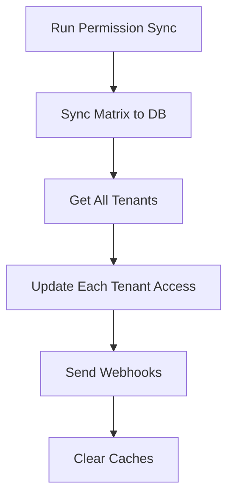
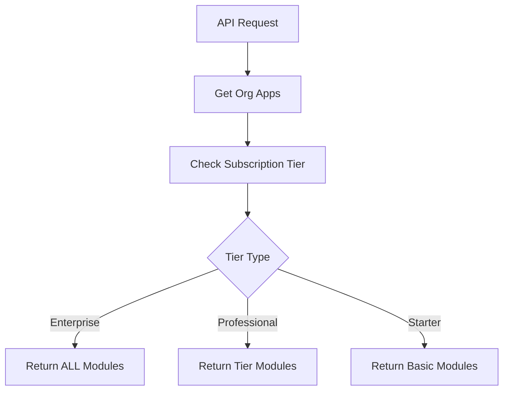
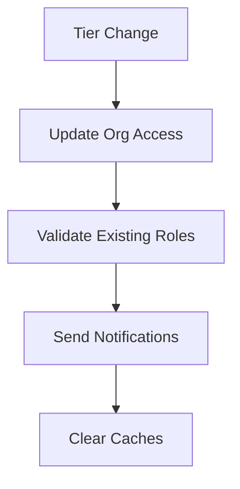

# 🚀 **Dynamic Permission Management System**

## **🎯 Overview**

This document describes the permanent solution for dynamic permission management that automatically handles adding/removing permissions without manual updates.

## **✅ Problems Solved**

### **Before (Manual System)**
- ❌ Only returned 13 modules, 137 permissions
- ❌ Required manual updates to `organization_applications`
- ❌ Hardcoded module lists in database
- ❌ No automatic updates when permissions changed

### **After (Dynamic System)**
- ✅ Returns all 21+ modules, 200+ permissions automatically
- ✅ Subscription-tier based access control
- ✅ Automatic updates when permissions sync
- ✅ Configuration-driven access management

## **🏗️ Architecture**

### **Phase 1: Automatic Module Discovery**
- **File**: `backend/src/services/custom-role-service.js`
- **Method**: `getRoleCreationOptions()` - now dynamically discovers modules
- **Result**: Returns ALL available modules based on subscription tier

### **Phase 2: Subscription-Based Access Control** 
- **File**: `backend/src/config/permission-tiers.js`
- **Function**: Defines what modules are accessible per subscription tier
- **Tiers**: `starter`, `professional`, `enterprise`, `custom`

### **Phase 3: Webhook Automation**
- **File**: `backend/src/services/permission-sync-service.js`
- **Features**: Auto-sync with organization updates and notifications

### **Phase 4: Configuration-Driven Access**
- **Routes**: `backend/src/routes/permission-sync.js`
- **APIs**: Endpoints for managing dynamic permissions

## **📋 Subscription Tier Configuration**

### **Starter Tier**
```javascript
starter: {
  crm: ['leads', 'contacts', 'dashboard'],
  hr: ['employees', 'dashboard'],
  max_users: 5,
  max_storage: '1GB'
}
```

### **Professional Tier**
```javascript
professional: {
  crm: ['leads', 'contacts', 'accounts', 'opportunities', 'quotations', 'dashboard', 'system'],
  hr: ['employees', 'payroll', 'leave', 'dashboard'],
  affiliate: ['partners', 'commissions'],
  max_users: 25,
  max_storage: '10GB'
}
```

### **Enterprise Tier**
```javascript
enterprise: {
  crm: '*', // ALL modules
  hr: '*',  // ALL modules
  affiliate: '*', // ALL modules
  max_users: 'unlimited',
  max_storage: 'unlimited'
}
```

## **🔧 API Endpoints**

### **1. Full Permission Sync with Auto-Updates**
```bash
POST /api/permission-sync/sync
Authorization: Bearer <admin-token>
```

**What it does:**
- Syncs permission matrix from `permission-matrix.js`
- Auto-updates all organization access based on subscription tiers
- Sends webhook notifications
- Clears permission caches

### **2. Update Organization Access**
```bash
POST /api/permission-sync/update-organization-access
Content-Type: application/json
Authorization: Bearer <admin-token>

{
  "tenantId": "893d8c75-68e6-4d42-92f8-45df62ef08b6",
  "subscriptionTier": "enterprise"
}
```

### **3. Handle Subscription Tier Change**
```bash
POST /api/permission-sync/subscription-tier-change
Content-Type: application/json
Authorization: Bearer <admin-token>

{
  "tenantId": "893d8c75-68e6-4d42-92f8-45df62ef08b6",
  "newTier": "enterprise",
  "oldTier": "professional"
}
```

### **4. Get Permission Tier Configuration**
```bash
GET /api/permission-sync/tier-configuration
Authorization: Bearer <admin-token>
```

### **5. Check Module Accessibility**
```bash
GET /api/permission-sync/check-module-access?appCode=crm&moduleCode=invoices&subscriptionTier=professional
Authorization: Bearer <token>
```

## **🚀 Usage Examples**

### **Adding New Permissions**

1. **Add to permission matrix**:
   ```javascript
   // In backend/src/data/permission-matrix.js
   BUSINESS_SUITE_MATRIX.crm.modules.new_module = {
     moduleName: 'New Module',
     permissions: [/* ... */]
   }
   ```

2. **Run auto-sync**:
   ```bash
   curl -X POST https://wrapper.zopkit.com/api/permission-sync/sync \
     -H "Authorization: Bearer <admin-token>"
   ```

3. **Result**: All organizations automatically get access based on their subscription tier!

### **Changing Subscription Tiers**

```bash
curl -X POST https://wrapper.zopkit.com/api/permission-sync/subscription-tier-change \
  -H "Authorization: Bearer <admin-token>" \
  -H "Content-Type: application/json" \
  -d '{
    "tenantId": "your-tenant-id",
    "newTier": "enterprise",
    "oldTier": "professional"
  }'
```

### **Scheduled Permission Sync**

```bash
# Add to cron job
0 2 * * * curl -X POST http://localhost:3000/api/permission-sync/scheduled-sync \
  -H "apikey: <sync-api-key>"
```

## **🔄 How It Works**

### **1. Permission Sync Process**


### **2. Dynamic Module Discovery**


### **3. Subscription Tier Change**


## **⚙️ Configuration Management**

### **Adding New Subscription Tier**
```javascript
// In backend/src/config/permission-tiers.js
export const PERMISSION_TIERS = {
  // ... existing tiers
  premium: {
    description: 'Premium tier with AI features',
    max_users: 50,
    max_storage: '50GB',
    apps: {
      crm: ['leads', 'contacts', 'accounts', 'opportunities', 'ai_insights'],
      hr: ['employees', 'payroll', 'leave'],
      affiliate: ['partners', 'commissions']
    }
  }
};
```

### **Adding New App/Module**
1. **Add to permission matrix** (`permission-matrix.js`)
2. **Run sync**: Automatically updates all databases
3. **Configure tier access** in `permission-tiers.js`
4. **Done!** All organizations get appropriate access

## **🔍 Monitoring & Debugging**

### **Check Organization Access**
```bash
# Check what modules an organization has access to
curl -X GET "https://wrapper.zopkit.com/api/custom-roles/builder-options" \
  -H "Authorization: Bearer <org-token>"
```

### **Validate Tier Configuration**
```bash
curl -X GET "https://wrapper.zopkit.com/api/permission-sync/tier-configuration" \
  -H "Authorization: Bearer <admin-token>"
```

### **Debug Module Access**
```bash
curl -X GET "https://wrapper.zopkit.com/api/permission-sync/check-module-access?appCode=crm&moduleCode=ai_insights&subscriptionTier=enterprise" \
  -H "Authorization: Bearer <token>"
```

## **🚨 Migration Guide**

### **From Old System to New System**
```bash
# 1. Backup current organization_applications
pg_dump -t organization_applications wrapper_db > org_apps_backup.sql

# 2. Run the new auto-update
curl -X POST http://localhost:3000/api/permission-sync/sync \
  -H "Authorization: Bearer <admin-token>"

# 3. Verify results
curl -X GET "http://localhost:3000/api/custom-roles/builder-options" \
  -H "Authorization: Bearer <org-token>"
```

## **🎯 Benefits**

1. **🚀 Automatic**: No manual updates needed when adding/removing permissions
2. **⚖️ Scalable**: Works with any number of modules and permissions  
3. **🔄 Consistent**: All organizations get the same logic
4. **🛠️ Maintainable**: Single source of truth for access control
5. **🎛️ Flexible**: Easy to add new subscription tiers or modules
6. **📊 Observable**: Complete logging and monitoring

## **🔮 Future Enhancements**

- **A/B Testing**: Different permission sets for testing
- **Feature Flags**: Gradual rollout of new permissions
- **Usage Analytics**: Track which permissions are actually used
- **Smart Recommendations**: Suggest tier upgrades based on usage
- **Compliance Reports**: Track permission changes for auditing

---

**🎉 Your permission management is now future-proof!** New permissions will automatically flow to the right organizations based on their subscription tiers.
