# Wrapper Platform - Comprehensive Architectural Overview

## Executive Summary

The Wrapper Platform is an enterprise-grade, multi-tenant SaaS wrapper solution built with modern architectural patterns. It provides a comprehensive foundation for building scalable, secure, and feature-rich applications with sophisticated multi-tenancy, event-driven communication, and enterprise-level observability.

## High-Level Design (HLD) Diagram

```mermaid
graph TB
    %% Internet and External World
    subgraph "External Layer"
        USERS[👥 End Users]
        APPS[📱 Mobile Apps]
        APIS[🔌 API Clients]
        CRM_SYS[🔗 CRM Systems]
    end

    %% CDN and Edge
    subgraph "Edge Layer"
        CDN[🌐 CDN<br/>Static Assets]
        WAF[🛡️ WAF<br/>DDoS Protection]
    end

    %% Load Balancing Layer
    subgraph "Load Balancing Layer"
        LB[⚖️ Load Balancer<br/>Nginx/HAProxy]
        SSL_TERM[🔒 SSL Termination]
    end

    %% Frontend Layer
    subgraph "Frontend Tier"
        FE_APP[⚛️ React Application<br/>TypeScript + Vite]
        
        subgraph "Frontend Components"
            ROUTER[🗺️ React Router]
            STATE[📊 State Management<br/>Zustand + React Query]
            UI_COMP[🎨 UI Components<br/>Radix + Tailwind]
        end
        
        subgraph "Authentication Layer"
            KINDE_FRONTEND[🔐 Kinde Auth React]
            TOKEN_MGR[🎫 JWT Token Manager]
        end
    end

    %% API Gateway and Security
    subgraph "API Gateway Tier"
        API_GW[🚪 API Gateway<br/>Fastify Router]
        
        subgraph "Security Middleware Stack"
            AUTH_MW[👤 Authentication<br/>JWT Validation]
            RLS_MW[🏢 Row Level Security<br/>Tenant Isolation]
            RATE_LIM[⏱️ Rate Limiting<br/>800 req/15min]
            CORS_MW[🌍 CORS Handler]
            VALIDATION[✅ Input Validation<br/>Zod Schemas]
            ERROR_HANDLER[🚨 Error Handler<br/>Centralized Logging]
        end
    end

    %% Application Services Layer
    subgraph "Application Services Tier"
        subgraph "Core Services"
            AUTH_SVC[🔑 Auth Service<br/>Kinde Integration]
            USER_SVC[👥 User Management<br/>CRUD Operations]
            ORG_SVC[🏢 Organization Service<br/>Hierarchical Structure]
            BILLING_SVC[💳 Billing Service<br/>Subscriptions + Payments]
            ADMIN_SVC[⚙️ Admin Service<br/>System Administration]
        end
        
        subgraph "Business Services"
            ONBOARDING_SVC[🎯 Onboarding Service<br/>User Flow Management]
            ROLE_SVC[🛡️ Role & Permission<br/>RBAC Implementation]
            CREDIT_SVC[💰 Credit System<br/>Usage Tracking]
            NOTIFICATION_SVC[📧 Notification Service<br/>Email + Webhooks]
        end
        
        subgraph "Integration Services"
            CRM_INT[🔗 CRM Integration<br/>Third-party Sync]
            WEBHOOK_SVC[🪝 Webhook Handler<br/>Event Processing]
            API_PROXY[🌉 API Proxy<br/>External Service Access]
        end
    end

    %% Event-Driven Architecture
    subgraph "Event Processing Layer"
        EVENT_BUS[📡 Event Publisher]
        REDIS_STREAMS[📬 Redis Streams<br/>Message Broker]
        EVENT_CONSUMER[👂 Event Consumer]
        
        subgraph "Event Types"
            USER_EVENTS[👤 User Events]
            ORG_EVENTS[🏢 Organization Events]
            BILLING_EVENTS[💳 Billing Events]
            SYSTEM_EVENTS[⚙️ System Events]
        end
    end

    %% Data Layer
    subgraph "Data Tier"
        subgraph "Primary Database"
            PG_MAIN[(🗄️ PostgreSQL<br/>Main Database)]
            
            subgraph "Database Components"
                CONN_POOL[🔌 Connection Pool]
                RLS_ENGINE[🏢 RLS Engine<br/>Tenant Isolation]
                TXN_MGR[📊 Transaction Manager]
                BACKUP_SVC[💾 Backup Service]
            end
            
            subgraph "Core Schema"
                TENANTS[🏢 Tenants]
                USERS[👥 Users]
                ORGS[🏢 Organizations]
                ROLES[🛡️ Roles & Permissions]
                SUBS[💳 Subscriptions]
                CREDITS[💰 Credits]
                AUDIT[📋 Audit Logs]
                EVENTS[📡 Event Tracking]
            end
        end
        
        subgraph "System Database"
            PG_SYSTEM[(🗄️ PostgreSQL<br/>System Database)]
            SCHEMA_MGMT[📊 Schema Management]
        end
    end

    %% Cache and Session Layer
    subgraph "Cache & Session Tier"
        REDIS_CLUSTER[(🔴 Redis Cluster<br/>Cache + Sessions)]
        
        subgraph "Cache Components"
            APP_CACHE[📊 Application Cache]
            SESSION_STORE[🎫 Session Store]
            RATE_LIMIT_STORE[⏱️ Rate Limit Store]
            WORKFLOW_CACHE[🔄 Workflow Cache]
        end
    end

    %% External Services
    subgraph "External Service Integrations"
        subgraph "Authentication Services"
            KINDE[🔐 Kinde Auth Service]
            JWT_SVC[🎫 JWT Service]
            SOCIAL_AUTH[🌐 Social Auth<br/>Google, GitHub]
        end
        
        subgraph "Payment Services"
            STRIPE[💳 Stripe<br/>Payment Processing]
            PAYMENT_WEBHOOKS[🪝 Payment Webhooks]
        end
        
        subgraph "Communication Services"
            EMAIL_SVC[📧 Email Service<br/>SendGrid/Mailgun]
            SMS_SVC[📱 SMS Service]
            PUSH_SVC[📲 Push Notifications]
        end
        
        subgraph "Third-party APIs"
            CRM_APIS[🔗 CRM APIs]
            WEBHOOK_ENDPOINTS[🪝 Webhook Endpoints]
            CDN_APIS[🌐 CDN APIs]
        end
    end

    %% Observability Stack
    subgraph "Observability Stack"
        subgraph "Logging Infrastructure"
            ELASTICSEARCH[(📊 Elasticsearch<br/>Log Aggregation)]
            LOG_SHIPPER[📦 Log Shipper<br/>Filebeat/Fluentd]
            KIBANA[📈 Kibana<br/>Log Visualization]
        end
        
        subgraph "Monitoring Components"
            METRICS[📊 Application Metrics]
            HEALTH_CHECKS[💓 Health Checks]
            ALERTING[🚨 Alerting System]
            DASHBOARDS[📊 Monitoring Dashboards]
        end
        
        subgraph "Tracing & APM"
            REQUEST_TRACING[🔍 Request Tracing]
            PERFORMANCE_MON[⚡ Performance Monitoring]
            ERROR_TRACKING[🚨 Error Tracking]
        end
    end

    %% Deployment Infrastructure
    subgraph "Deployment Infrastructure"
        subgraph "Container Orchestration"
            DOCKER[🐳 Docker Containers]
            COMPOSE[🐙 Docker Compose<br/>Development]
            K8S[☸️ Kubernetes<br/>Production]
        end
        
        subgraph "CI/CD Pipeline"
            GIT_REPO[📁 Git Repository]
            CI_PIPELINE[🔄 CI Pipeline<br/>GitHub Actions]
            CD_PIPELINE[🚀 CD Pipeline<br/>Automated Deploy]
        end
    end

    %% Data Flow Connections
    USERS --> CDN
    APPS --> WAF
    APIS --> LB
    CRM_SYS --> API_GW
    
    CDN --> LB
    WAF --> LB
    LB --> SSL_TERM
    SSL_TERM --> API_GW
    
    API_GW --> AUTH_MW
    AUTH_MW --> RLS_MW
    RLS_MW --> RATE_LIM
    RATE_LIM --> CORS_MW
    CORS_MW --> VALIDATION
    VALIDATION --> ERROR_HANDLER
    
    ERROR_HANDLER --> AUTH_SVC
    ERROR_HANDLER --> USER_SVC
    ERROR_HANDLER --> ORG_SVC
    ERROR_HANDLER --> BILLING_SVC
    ERROR_HANDLER --> ADMIN_SVC
    ERROR_HANDLER --> ONBOARDING_SVC
    ERROR_HANDLER --> ROLE_SVC
    ERROR_HANDLER --> CREDIT_SVC
    ERROR_HANDLER --> NOTIFICATION_SVC
    
    ONBOARDING_SVC --> EVENT_BUS
    USER_SVC --> EVENT_BUS
    ORG_SVC --> EVENT_BUS
    BILLING_SVC --> EVENT_BUS
    
    EVENT_BUS --> REDIS_STREAMS
    REDIS_STREAMS --> EVENT_CONSUMER
    EVENT_CONSUMER --> USER_EVENTS
    EVENT_CONSUMER --> ORG_EVENTS
    EVENT_CONSUMER --> BILLING_EVENTS
    EVENT_CONSUMER --> SYSTEM_EVENTS
    
    AUTH_SVC --> KINDE
    BILLING_SVC --> STRIPE
    NOTIFICATION_SVC --> EMAIL_SVC
    WEBHOOK_SVC --> PAYMENT_WEBHOOKS
    
    RLS_MW --> PG_MAIN
    USER_SVC --> PG_MAIN
    ORG_SVC --> PG_MAIN
    BILLING_SVC --> PG_MAIN
    ADMIN_SVC --> PG_MAIN
    
    PG_MAIN --> CONN_POOL
    CONN_POOL --> RLS_ENGINE
    
    API_GW --> REDIS_CLUSTER
    SESSION_STORE --> REDIS_CLUSTER
    RATE_LIMIT_STORE --> REDIS_CLUSTER
    
    ERROR_HANDLER --> LOG_SHIPPER
    LOG_SHIPPER --> ELASTICSEARCH
    ELASTICSEARCH --> KIBANA
    
    METRICS --> KIBANA
    HEALTH_CHECKS --> KIBANA
    ALERTING --> KIBANA
    
    DOCKER --> K8S
    CI_PIPELINE --> CD_PIPELINE

    %% Styling
    classDef external fill:#f8f9fa,stroke:#343a40,stroke-width:2px
    classDef frontend fill:#e3f2fd,stroke:#1565c0,stroke-width:2px
    classDef backend fill:#f3e5f5,stroke:#7b1fa2,stroke-width:2px
    classDef data fill:#e8f5e8,stroke:#2e7d32,stroke-width:2px
    classDef cache fill:#fff3e0,stroke:#f57c00,stroke-width:2px
    classDef auth fill:#fce4ec,stroke:#c2185b,stroke-width:2px
    classDef monitoring fill:#f1f8e9,stroke:#558b2f,stroke-width:2px
    classDef infrastructure fill:#e0f2f1,stroke:#00695c,stroke-width:2px
    classDef externalService fill:#fafafa,stroke:#616161,stroke-width:2px
    
    class USERS,APPS,APIS,CRM_SYS external
    class FE_APP,ROUTER,STATE,UI_COMP,KINDE_FRONTEND,TOKEN_MGR frontend
    class API_GW,AUTH_MW,RLS_MW,RATE_LIM,CORS_MW,VALIDATION,ERROR_HANDLER,AUTH_SVC,USER_SVC,ORG_SVC,BILLING_SVC,ADMIN_SVC,ONBOARDING_SVC,ROLE_SVC,CREDIT_SVC,NOTIFICATION_SVC,CRM_INT,WEBHOOK_SVC,API_PROXY,EVENT_BUS,REDIS_STREAMS,EVENT_CONSUMER,USER_EVENTS,ORG_EVENTS,BILLING_EVENTS,SYSTEM_EVENTS backend
    class PG_MAIN,PG_SYSTEM,CONN_POOL,RLS_ENGINE,TXN_MGR,BACKUP_SVC,TENANTS,USERS,ORGS,ROLES,SUBS,CREDITS,AUDIT,EVENTS,SCHEMA_MGMT data
    class REDIS_CLUSTER,APP_CACHE,SESSION_STORE,RATE_LIMIT_STORE,WORKFLOW_CACHE cache
    class KINDE,JWT_SVC,SOCIAL_AUTH,STRIPE,PAYMENT_WEBHOOKS,EMAIL_SVC,SMS_SVC,PUSH_SVC,CRM_APIS,WEBHOOK_ENDPOINTS,CDN_APIS auth
    class ELASTICSEARCH,LOG_SHIPPER,KIBANA,METRICS,HEALTH_CHECKS,ALERTING,DASHBOARDS,REQUEST_TRACING,PERFORMANCE_MON,ERROR_TRACKING monitoring
    class DOCKER,COMPOSE,K8S,GIT_REPO,CI_PIPELINE,CD_PIPELINE infrastructure
    class CDN,WAF,LB,SSL_TERM externalService
```



## System Components Overview

### 1. Frontend Tier
**Technology Stack**: React 18 + TypeScript + Vite + Tailwind CSS

**Key Components**:
- **React Application**: Main SPA with component-based architecture
- **Routing**: React Router v6 for client-side navigation
- **State Management**: Zustand for global state + TanStack Query for server state
- **UI Components**: Radix UI primitives with custom styling
- **Authentication**: Kinde Auth React for seamless auth integration

**Features**:
- Responsive design with mobile-first approach
- Progressive Web App (PWA) capabilities
- Real-time updates via WebSocket connections
- Comprehensive error boundaries and loading states

### 2. API Gateway & Security Layer
**Technology Stack**: Fastify + Custom Middleware Stack

**Security Middleware Stack**:
1. **Authentication Middleware**: JWT token validation via Kinde
2. **Row Level Security**: Tenant context enforcement
3. **Rate Limiting**: Configurable limits (800 req/15min default)
4. **CORS Handler**: Cross-origin request management
5. **Input Validation**: Zod schema validation
6. **Error Handler**: Centralized error processing and logging

**API Gateway Features**:
- Request/response transformation
- API versioning support
- Request tracing and correlation IDs
- Comprehensive API documentation (Swagger/OpenAPI)

### 3. Application Services Layer
**Architecture Pattern**: Feature-based modular design

**Core Services**:
- **Auth Service**: Kinde integration, JWT management, social login
- **User Management**: CRUD operations, user lifecycle management
- **Organization Service**: Hierarchical organization structure
- **Billing Service**: Subscription management, payment processing
- **Admin Service**: System administration, tenant management

**Business Services**:
- **Onboarding Service**: User onboarding workflows, progress tracking
- **Role & Permission Service**: RBAC implementation, permission matrix
- **Credit System**: Usage tracking, credit allocation, billing integration
- **Notification Service**: Email, SMS, push notifications, webhooks

**Integration Services**:
- **CRM Integration**: Third-party CRM synchronization
- **Webhook Handler**: Event processing from external services
- **API Proxy**: Secure proxy to external services

### 4. Event-Driven Architecture
**Technology Stack**: Redis Streams for message brokering

**Event Processing Flow**:
1. **Event Publisher**: Services publish events when state changes
2. **Redis Streams**: Durable message storage with consumer groups
3. **Event Consumer**: Processes events and updates local state
4. **Event Types**: User events, organization events, billing events, system events

**Benefits**:
- Loose coupling between services
- Asynchronous processing capabilities
- Horizontal scalability via consumer groups
- Guaranteed message delivery

### 5. Data Layer
**Technology Stack**: PostgreSQL with Drizzle ORM

**Database Architecture**:
- **Multi-Connection Strategy**: App connection (RLS enforced) + System connection (bypass RLS)
- **Connection Pooling**: Efficient connection management
- **Row Level Security**: Database-level tenant isolation
- **Transaction Management**: ACID compliance with proper isolation levels

**Core Schema Tables**:
- **Tenants**: Multi-tenant root entity
- **Users**: User accounts and profiles
- **Organizations**: Hierarchical organizational structure
- **Roles & Permissions**: RBAC implementation
- **Subscriptions**: Billing and subscription management
- **Credits**: Usage tracking and credit system
- **Audit Logs**: Comprehensive activity tracking
- **Event Tracking**: Event-driven architecture support

**Data Management Features**:
- Automated backups with point-in-time recovery
- Database migrations with version control
- Query optimization and indexing
- Performance monitoring and analysis

### 6. Cache & Session Layer
**Technology Stack**: Redis Cluster for high availability

**Cache Components**:
- **Application Cache**: Frequently accessed data (user sessions, permissions)
- **Session Store**: User session management
- **Rate Limit Store**: Distributed rate limiting
- **Workflow Cache**: Onboarding and workflow state management

**Performance Optimizations**:
- Multi-level caching strategy
- Cache invalidation policies
- Distributed caching for scalability
- Cache warming for critical data

### 7. External Service Integrations

**Authentication Services**:
- **Kinde Auth**: Primary authentication provider with OAuth2/OIDC
- **JWT Service**: Token generation and validation
- **Social Auth**: Google, GitHub, and other OAuth providers

**Payment Services**:
- **Stripe**: Payment processing, subscription management
- **Payment Webhooks**: Real-time payment event processing

**Communication Services**:
- **Email Service**: Transactional emails (SendGrid/Mailgun)
- **SMS Service**: Two-factor authentication, notifications
- **Push Notifications**: Mobile app notifications

**Third-party APIs**:
- **CRM APIs**: Integration with external CRM systems
- **Webhook Endpoints**: Event processing from external services
- **CDN APIs**: Content delivery optimization

### 8. Observability Stack
**Technology Stack**: Elasticsearch + Kibana + Custom Metrics

**Logging Infrastructure**:
- **Log Aggregation**: Centralized logging via Elasticsearch
- **Log Shipping**: Automated log collection and shipping
- **Log Visualization**: Kibana dashboards for log analysis
- **Structured Logging**: JSON-based logging with correlation IDs

**Monitoring Components**:
- **Application Metrics**: Custom business metrics and KPIs
- **Health Checks**: System health monitoring
- **Alerting**: Proactive monitoring and alerting
- **Dashboards**: Real-time monitoring dashboards

**Tracing & APM**:
- **Request Tracing**: End-to-end request tracking
- **Performance Monitoring**: Application performance insights
- **Error Tracking**: Comprehensive error monitoring and analysis

### 9. Deployment Infrastructure
**Technology Stack**: Docker + Kubernetes + CI/CD Pipelines

**Container Strategy**:
- **Docker**: Application containerization
- **Docker Compose**: Local development environment
- **Kubernetes**: Production container orchestration

**CI/CD Pipeline**:
- **Git Repository**: Source code management
- **CI Pipeline**: Automated testing and build (GitHub Actions)
- **CD Pipeline**: Automated deployment to staging/production

## Data Flow Architecture

### 1. Authentication Flow
```
User Login → Kinde Auth → JWT Token → Frontend → Backend API → RLS Context → Database
```

**Steps**:
1. User initiates login via frontend
2. Frontend redirects to Kinde authentication
3. Kinde validates credentials and returns JWT token
4. Frontend stores token and sends with API requests
5. Backend validates token via Auth middleware
6. RLS middleware establishes tenant context
7. Database queries are automatically filtered by tenant

### 2. API Request Flow
```
Client Request → Load Balancer → API Gateway → Middleware Stack → Service Layer → Database
```

**Middleware Processing Order**:
1. **Load Balancer**: Distributes requests across instances
2. **API Gateway**: Routes request to appropriate handler
3. **Authentication**: Validates JWT token and extracts user context
4. **RLS**: Establishes tenant isolation context
5. **Rate Limiting**: Enforces API rate limits
6. **CORS**: Handles cross-origin requests
7. **Validation**: Validates request payload
8. **Service Handler**: Processes business logic
9. **Database**: Executes queries with tenant filtering
10. **Response**: Returns formatted response to client

### 3. Event Processing Flow
```
Service A → Event Publisher → Redis Streams → Event Consumer → Service B → Database Update
```

**Event Processing Steps**:
1. Service A performs state-changing operation
2. Service A publishes event to Redis Streams
3. Event is stored durably with unique ID and timestamp
4. Event Consumer reads event from stream
5. Consumer routes event to appropriate handler
6. Handler processes event and updates local state
7. Consumer acknowledges successful processing
8. Event is removed from stream

### 4. Multi-Tenant Data Access Flow
```
Request → Tenant Context → RLS Engine → Filtered Query → Isolated Results
```

**Tenant Isolation Steps**:
1. Request includes tenant identifier (JWT claims)
2. Auth middleware extracts tenant context
3. RLS middleware sets database session variable
4. All database queries automatically filter by tenant
5. Results are guaranteed to be tenant-specific
6. No possibility of cross-tenant data leakage

## Security Architecture

### 1. Authentication Security
- **Multi-Factor Authentication**: Support for 2FA/MFA via Kinde
- **Token Management**: Secure JWT token generation and validation
- **Session Management**: Secure session handling with Redis
- **Social Login**: Secure OAuth integration with major providers

### 2. Authorization Security
- **Role-Based Access Control (RBAC)**: Hierarchical role system
- **Permission Matrix**: Granular permission management
- **Resource-Level Security**: Organization-based access control
- **API-Level Protection**: Endpoint-specific authorization

### 3. Data Security
- **Row Level Security**: Database-level tenant isolation
- **Connection Security**: Encrypted database connections
- **Input Sanitization**: XSS and injection prevention
- **Audit Logging**: Comprehensive security event logging

### 4. Network Security
- **SSL/TLS**: End-to-end encryption
- **CORS Configuration**: Secure cross-origin requests
- **Rate Limiting**: DDoS and abuse prevention
- **WAF Integration**: Web application firewall protection

## Tenant Isolation Strategies

### 1. Database-Level Isolation
**Row Level Security (RLS)**:
- Every table includes tenant identifier
- RLS policies enforce tenant filtering at database level
- Automatic query modification by PostgreSQL
- No possibility of cross-tenant data access

### 2. Application-Level Isolation
**Tenant Context Management**:
- Tenant context extracted from JWT claims
- Context propagated through request lifecycle
- Service layer operates within tenant context
- Logging and monitoring include tenant identifiers

### 3. Cache-Level Isolation
**Tenant-Specific Caching**:
- Cache keys include tenant identifier
- Separate cache namespaces per tenant
- Cache invalidation respects tenant boundaries
- No cross-tenant cache pollution

### 4. Event-Level Isolation
**Event Stream Segmentation**:
- Events include tenant identifier
- Consumers filter events by tenant
- Event processing respects tenant boundaries
- Audit trails include tenant context

## Caching and Performance Architecture

### 1. Multi-Level Caching Strategy
- **Browser Cache**: Static assets and API responses
- **CDN Cache**: Global content delivery
- **Application Cache**: Redis-based data caching
- **Database Cache**: Query result caching

### 2. Cache Management
**Cache Patterns**:
- **Cache-Aside**: Application manages cache population
- **Write-Through**: Cache updated on database writes
- **Write-Behind**: Async cache updates for performance

**Cache Invalidation**:
- **Time-based Expiration**: TTL-based cache expiry
- **Event-driven Invalidation**: Cache updates via events
- **Manual Invalidation**: Admin-triggered cache clears

### 3. Performance Optimizations
**Database Optimizations**:
- **Query Optimization**: Efficient ORM usage and query analysis
- **Indexing Strategy**: Comprehensive index coverage
- **Connection Pooling**: Efficient connection management
- **Query Caching**: Database-level query result caching

**Application Optimizations**:
- **Lazy Loading**: On-demand resource loading
- **Code Splitting**: Dynamic module loading
- **Bundle Optimization**: Tree shaking and minification
- **Image Optimization**: Responsive images and lazy loading

## Error Handling and Resilience

### 1. Error Handling Strategy
**Hierarchical Error Handling**:
1. **Component Level**: React error boundaries
2. **API Level**: Centralized error processing
3. **Service Level**: Business logic error handling
4. **Database Level**: Transaction rollback and retry

### 2. Resilience Patterns
**Circuit Breaker**: Prevent cascade failures
**Retry Logic**: Exponential backoff for transient failures
**Timeout Management**: Request timeout handling
**Graceful Degradation**: Feature flags for service degradation

### 3. Monitoring and Alerting
**Error Tracking**:
- Real-time error monitoring
- Error correlation and grouping
- Performance impact analysis
- Automated alerting for critical errors

## Monitoring and Observability

### 1. Application Monitoring
**Business Metrics**:
- User registration and onboarding rates
- Feature adoption and usage patterns
- Subscription and billing metrics
- Customer satisfaction scores

**Technical Metrics**:
- Request latency and throughput
- Error rates and types
- Database performance metrics
- Cache hit/miss ratios

### 2. Infrastructure Monitoring
**System Metrics**:
- CPU, memory, and disk utilization
- Network traffic and latency
- Container and pod health
- Database connection pool status

### 3. Security Monitoring
**Security Events**:
- Authentication attempts and failures
- Authorization denials
- Suspicious activity patterns
- Data access and modification logs

## Third-Party Integrations

### 1. Authentication Integrations
**Kinde Auth**:
- OAuth2/OIDC provider
- Social login providers (Google, GitHub)
- Enterprise SSO support
- Multi-factor authentication

### 2. Payment Integrations
**Stripe**:
- Payment processing
- Subscription management
- Webhook handling
- Invoice generation

### 3. Communication Integrations
**Email Services**:
- SendGrid for transactional emails
- Mailgun for email delivery
- Template management
- Delivery tracking

### 4. CRM Integrations
**CRM Systems**:
- Salesforce integration
- HubSpot synchronization
- Custom CRM webhooks
- Data mapping and transformation

## Deployment Topology

### 1. Development Environment
**Local Development**:
- Docker Compose setup
- Local PostgreSQL instance
- Local Redis instance
- Local Elasticsearch/Kibana

### 2. Staging Environment
**Pre-Production Testing**:
- Production-like infrastructure
- Integration testing
- Performance testing
- Security testing

### 3. Production Environment
**High Availability Setup**:
- Load balancer with multiple API instances
- Master-slave database replication
- Redis cluster for high availability
- Elasticsearch cluster for logging

### 4. Disaster Recovery
**Backup and Recovery**:
- Automated database backups
- Point-in-time recovery
- Cross-region backup replication
- Disaster recovery runbooks

## Conclusion

The Wrapper Platform represents a state-of-the-art, enterprise-grade architecture that successfully addresses the complex challenges of multi-tenant SaaS applications. The comprehensive design includes:

- **Security First**: Multi-layered security with authentication, authorization, and data isolation
- **Scalability**: Horizontal and vertical scaling capabilities with event-driven architecture
- **Observability**: Comprehensive monitoring, logging, and alerting
- **Resilience**: Fault-tolerant design with proper error handling and recovery
- **Flexibility**: Modular architecture supporting rapid feature development
- **Integration**: Extensive third-party integrations and API-first design

This architecture provides a robust foundation for building and scaling enterprise SaaS applications with complex multi-tenancy requirements while maintaining security, performance, and operational excellence.
