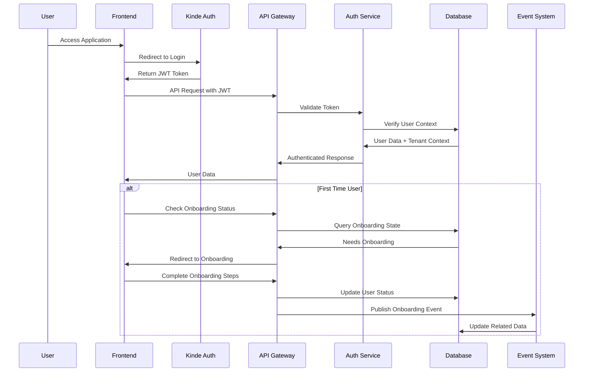
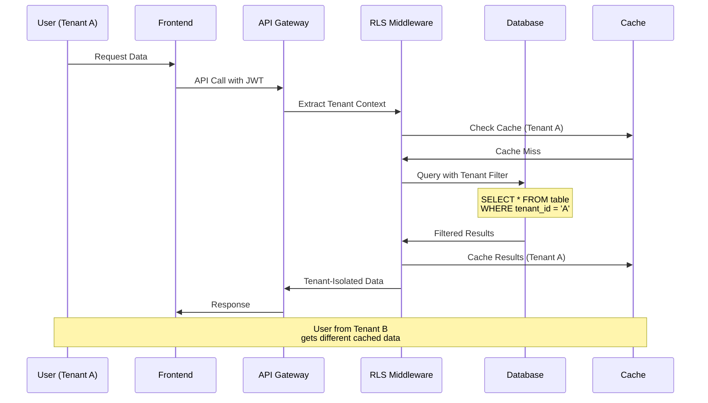
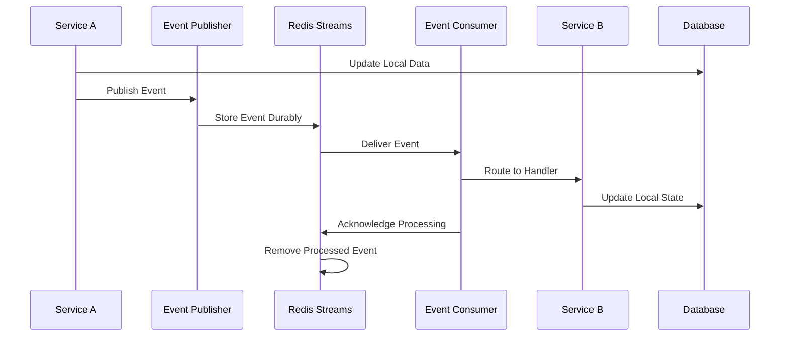
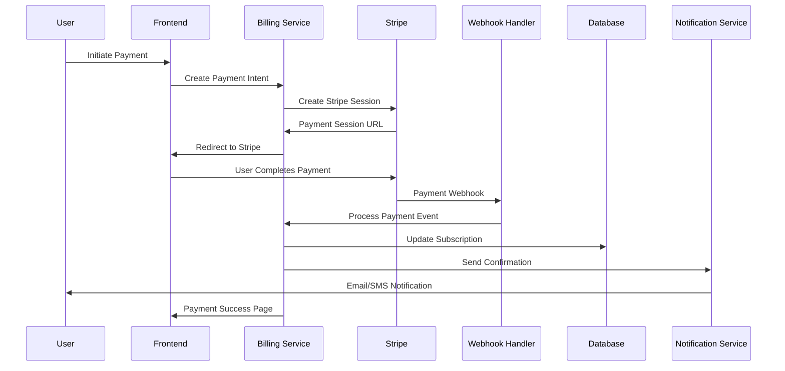
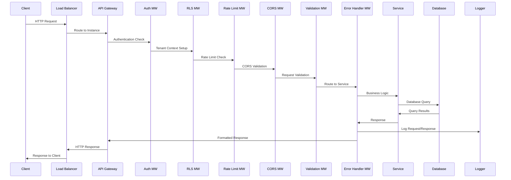
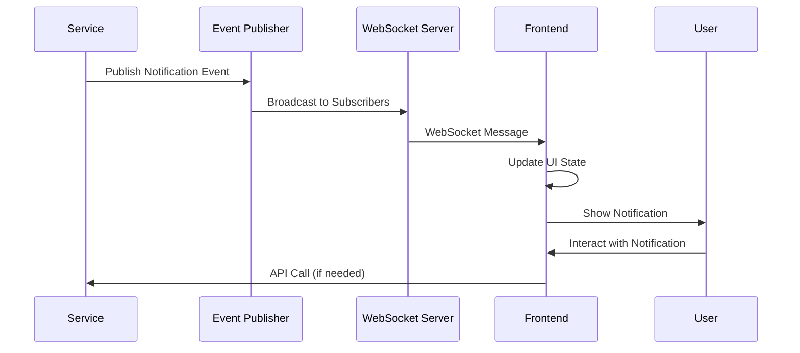

# Wrapper Platform - Comprehensive Flow Diagram

## System Overview & Complete Architecture Flow

```mermaid
graph TB
    %% External Users and Entry Points
    subgraph "External Users & Entry Points"
        WEB_USER[👤 Web User<br/>Browser Client]
        MOBILE_USER[📱 Mobile User<br/>Mobile App]
        API_CLIENT[🔌 API Client<br/>Third-party Integration]
        CRM_SYSTEM[🔗 CRM System<br/>External Integration]
        ADMIN_USER[⚙️ Admin User<br/>System Administrator]
    end

    %% CDN and Edge Services
    subgraph "Edge Services"
        CDN[🌐 Content Delivery Network<br/>Static Assets, Images]
        WAF[🛡️ Web Application Firewall<br/>DDoS Protection, Security]
    end

    %% Load Balancing Layer
    subgraph "Load Balancing & SSL"
        LOAD_BALANCER[⚖️ Load Balancer<br/>Nginx/HAProxy<br/>Traffic Distribution]
        SSL_TERMINATION[🔒 SSL Termination<br/>HTTPS Encryption]
    end

    %% Frontend Application Layer
    subgraph "Frontend Application (React + TypeScript)"
        REACT_APP[⚛️ React SPA<br/>Main Application]

        subgraph "Frontend Architecture"
            ROUTER[🗺️ React Router<br/>Client-side Routing]
            STATE_MGMT[📊 State Management<br/>Zustand + React Query]
            UI_COMPONENTS[🎨 UI Components<br/>Radix UI + Tailwind CSS]
            HOOKS[🪝 Custom Hooks<br/>Business Logic]
        end

        subgraph "Authentication Layer"
            KINDE_FRONTEND[🔐 Kinde Auth React<br/>OAuth2/OIDC Client]
            TOKEN_MANAGER[🎫 JWT Token Manager<br/>Token Storage & Refresh]
            AUTH_GUARD[🚪 Auth Guards<br/>Route Protection]
        end

        subgraph "Real-time Features"
            WEBSOCKET_CLIENT[📡 WebSocket Client<br/>Real-time Notifications]
            REALTIME_UPDATES[🔄 Live Updates<br/>Event-driven UI]
        end
    end

    %% API Gateway & Security Middleware
    subgraph "API Gateway & Security (Fastify)"
        API_GATEWAY[🚪 API Gateway<br/>Request Routing]

        subgraph "Security Middleware Stack"
            AUTH_MIDDLEWARE[👤 Authentication MW<br/>JWT Validation]
            RLS_MIDDLEWARE[🏢 Row Level Security MW<br/>Tenant Context]
            RATE_LIMIT_MW[⏱️ Rate Limiting MW<br/>800 req/15min]
            CORS_MIDDLEWARE[🌍 CORS MW<br/>Cross-origin Handling]
            VALIDATION_MW[✅ Validation MW<br/>Zod Schema Validation]
            ERROR_HANDLER_MW[🚨 Error Handler MW<br/>Centralized Error Processing]
        end

        subgraph "API Features"
            SWAGGER_DOCS[📚 API Documentation<br/>Swagger/OpenAPI]
            REQUEST_TRACING[🔍 Request Tracing<br/>Correlation IDs]
            API_VERSIONING[🏷️ API Versioning<br/>Version Management]
        end
    end

    %% Application Services Layer
    subgraph "Application Services Layer"
        subgraph "Core Business Services"
            AUTH_SERVICE[🔑 Auth Service<br/>Kinde Integration, JWT]
            USER_SERVICE[👥 User Management<br/>CRUD, Lifecycle]
            ORG_SERVICE[🏢 Organization Service<br/>Hierarchical Structure]
            BILLING_SERVICE[💳 Billing Service<br/>Subscriptions, Payments]
            ADMIN_SERVICE[⚙️ Admin Service<br/>System Administration]
        end

        subgraph "Business Logic Services"
            ONBOARDING_SERVICE[🎯 Onboarding Service<br/>User Flow Management]
            ROLE_SERVICE[🛡️ Role & Permission Service<br/>RBAC Implementation]
            CREDIT_SERVICE[💰 Credit System<br/>Usage Tracking]
            NOTIFICATION_SERVICE[📧 Notification Service<br/>Email, SMS, Push]
            ANALYTICS_SERVICE[📊 Analytics Service<br/>Usage Metrics]
        end

        subgraph "Integration Services"
            CRM_INTEGRATION[🔗 CRM Integration<br/>Third-party Sync]
            WEBHOOK_HANDLER[🪝 Webhook Handler<br/>Event Processing]
            API_PROXY[🌉 API Proxy<br/>External Service Access]
            DNS_SERVICE[🌐 DNS Management<br/>Domain Configuration]
        end
    end

    %% Event-Driven Architecture
    subgraph "Event-Driven Architecture"
        EVENT_PUBLISHER[📡 Event Publisher<br/>State Change Events]

        subgraph "Message Broker"
            REDIS_STREAMS[📬 Redis Streams<br/>Durable Message Queue]
            CONSUMER_GROUPS[👥 Consumer Groups<br/>Parallel Processing]
            EVENT_ROUTER[🗺️ Event Router<br/>Event Type Routing]
        end

        subgraph "Event Consumers"
            USER_EVENT_CONSUMER[👤 User Event Consumer<br/>User Data Sync]
            ORG_EVENT_CONSUMER[🏢 Org Event Consumer<br/>Organization Updates]
            BILLING_EVENT_CONSUMER[💳 Billing Event Consumer<br/>Subscription Updates]
            SYSTEM_EVENT_CONSUMER[⚙️ System Event Consumer<br/>System Operations]
        end

        subgraph "Event Types"
            USER_EVENTS[👤 User Events<br/>created, updated, deleted]
            ORG_EVENTS[🏢 Organization Events<br/>structure changes]
            BILLING_EVENTS[💳 Billing Events<br/>payment, subscription]
            AUDIT_EVENTS[📋 Audit Events<br/>security, compliance]
        end
    end

    %% Data Layer Architecture
    subgraph "Data Layer Architecture"
        subgraph "Database Connections"
            APP_CONNECTION[🔌 App Connection<br/>RLS Enforced]
            SYSTEM_CONNECTION[🔌 System Connection<br/>RLS Bypassed]
            CONNECTION_POOL[🏊 Connection Pool<br/>Performance Optimization]
        end

        subgraph "Primary Database (PostgreSQL)"
            MAIN_DB[(🗄️ Main Database<br/>Tenant Data)]

            subgraph "Core Schema"
                TENANTS_TABLE[🏢 tenants<br/>Multi-tenant root]
                USERS_TABLE[👥 tenant_users<br/>User accounts]
                ORGANIZATIONS_TABLE[🏢 unified_entities<br/>Hierarchical orgs]
                ROLES_TABLE[🛡️ custom_roles<br/>RBAC roles]
                PERMISSIONS_TABLE[🔐 permissions<br/>Access control]
                SUBSCRIPTIONS_TABLE[💳 subscriptions<br/>Billing plans]
                CREDITS_TABLE[💰 credits<br/>Usage tracking]
                AUDIT_TABLE[📋 audit_logs<br/>Activity tracking]
            end

            subgraph "Database Features"
                RLS_ENGINE[🏢 RLS Engine<br/>Tenant Isolation]
                INDEXES[🔍 Performance Indexes<br/>Query Optimization]
                TRIGGERS[⚡ Database Triggers<br/>Automated Actions]
                BACKUPS[💾 Automated Backups<br/>Data Protection]
            end
        end

        subgraph "System Database"
            SYSTEM_DB[(🗄️ System Database<br/>Global Data)]
            MIGRATIONS[📊 Schema Migrations<br/>Version Control]
            METADATA[📋 System Metadata<br/>Configuration]
        end
    end

    %% Cache & Session Management
    subgraph "Cache & Session Management"
        REDIS_CLUSTER[🔴 Redis Cluster<br/>High Availability]

        subgraph "Cache Components"
            SESSION_STORE[🎫 Session Store<br/>User Sessions]
            APP_CACHE[📊 Application Cache<br/>Frequently Used Data]
            RATE_LIMIT_STORE[⏱️ Rate Limit Store<br/>API Throttling]
            WORKFLOW_CACHE[🔄 Workflow Cache<br/>Process State]
        end

        subgraph "Cache Strategies"
            CACHE_ASIDE[📥 Cache-Aside<br/>Lazy Loading]
            WRITE_THROUGH[📤 Write-Through<br/>Immediate Updates]
            CACHE_INVALIDATION[🗑️ Cache Invalidation<br/>Event-Driven]
        end
    end

    %% External Service Integrations
    subgraph "External Service Integrations"
        subgraph "Authentication Services"
            KINDE_AUTH[🔐 Kinde Auth Service<br/>OAuth2/OIDC Provider]
            SOCIAL_PROVIDERS[🌐 Social Login<br/>Google, GitHub, etc.]
            JWT_SERVICE[🎫 JWT Token Service<br/>Token Generation]
        end

        subgraph "Payment & Billing"
            STRIPE[💳 Stripe<br/>Payment Processing]
            PAYMENT_WEBHOOKS[🪝 Stripe Webhooks<br/>Payment Events]
            INVOICE_SERVICE[📄 Invoice Generation<br/>Billing Documents]
        end

        subgraph "Communication Services"
            EMAIL_SERVICE[📧 Email Service<br/>SendGrid/Mailgun]
            SMS_SERVICE[📱 SMS Service<br/>Twilio]
            PUSH_SERVICE[📲 Push Notifications<br/>Firebase/OneSignal]
        end

        subgraph "Third-party APIs"
            CRM_APIS[🔗 CRM APIs<br/>Salesforce, HubSpot]
            EXTERNAL_WEBHOOKS[🪝 External Webhooks<br/>Event Notifications]
            CDN_APIS[🌐 CDN APIs<br/>Asset Management]
        end
    end

    %% Observability & Monitoring
    subgraph "Observability & Monitoring Stack"
        subgraph "Logging Infrastructure"
            ELASTICSEARCH[(📊 Elasticsearch<br/>Log Aggregation)]
            LOG_SHIPPER[📦 Log Shipper<br/>Filebeat/Fluentd]
            KIBANA[📈 Kibana<br/>Log Visualization]
        end

        subgraph "Monitoring & Alerting"
            APPLICATION_METRICS[📊 App Metrics<br/>Business KPIs]
            INFRA_METRICS[🖥️ Infra Metrics<br/>System Health]
            ERROR_TRACKING[🚨 Error Tracking<br/>Exception Monitoring]
            ALERT_MANAGER[🚨 Alert Manager<br/>Automated Alerts]
        end

        subgraph "Tracing & APM"
            REQUEST_TRACING[🔍 Distributed Tracing<br/>Request Flow]
            PERFORMANCE_MON[⚡ Performance Monitoring<br/>Latency, Throughput]
            USER_ANALYTICS[👥 User Analytics<br/>Behavior Tracking]
        end
    end

    %% Deployment & Infrastructure
    subgraph "Deployment & Infrastructure"
        subgraph "Container Orchestration"
            DOCKER[🐳 Docker Containers<br/>Application Packaging]
            KUBERNETES[☸️ Kubernetes<br/>Production Orchestration]
            DOCKER_COMPOSE[🐙 Docker Compose<br/>Development Stack]
        end

        subgraph "CI/CD Pipeline"
            GIT_REPO[📁 Git Repository<br/>Source Control]
            CI_PIPELINE[🔄 CI Pipeline<br/>Automated Testing]
            CD_PIPELINE[🚀 CD Pipeline<br/>Automated Deployment]
            ARTIFACT_REPO[📦 Artifact Repository<br/>Build Artifacts]
        end

        subgraph "Infrastructure Components"
            LOAD_BALANCER_INFRA[⚖️ Load Balancer<br/>Traffic Distribution]
            DATABASE_CLUSTER[🗄️ Database Cluster<br/>Master-Slave Replication]
            CACHE_CLUSTER[🔴 Cache Cluster<br/>Redis Cluster]
            MONITORING_CLUSTER[📊 Monitoring Cluster<br/>ELK Stack]
        end
    end

    %% Data Flow Connections - User Journey
    WEB_USER --> CDN
    MOBILE_USER --> WAF
    API_CLIENT --> LOAD_BALANCER
    CRM_SYSTEM --> LOAD_BALANCER
    ADMIN_USER --> LOAD_BALANCER

    CDN --> LOAD_BALANCER
    WAF --> LOAD_BALANCER
    LOAD_BALANCER --> SSL_TERMINATION
    SSL_TERMINATION --> REACT_APP

    REACT_APP --> ROUTER
    ROUTER --> STATE_MGMT
    STATE_MGMT --> UI_COMPONENTS
    UI_COMPONENTS --> HOOKS

    REACT_APP --> KINDE_FRONTEND
    KINDE_FRONTEND --> TOKEN_MANAGER
    TOKEN_MANAGER --> AUTH_GUARD

    REACT_APP --> WEBSOCKET_CLIENT
    WEBSOCKET_CLIENT --> REALTIME_UPDATES

    REACT_APP --> API_GATEWAY
    API_GATEWAY --> AUTH_MIDDLEWARE
    AUTH_MIDDLEWARE --> RLS_MIDDLEWARE
    RLS_MIDDLEWARE --> RATE_LIMIT_MW
    RATE_LIMIT_MW --> CORS_MIDDLEWARE
    CORS_MIDDLEWARE --> VALIDATION_MW
    VALIDATION_MW --> ERROR_HANDLER_MW

    ERROR_HANDLER_MW --> AUTH_SERVICE
    ERROR_HANDLER_MW --> USER_SERVICE
    ERROR_HANDLER_MW --> ORG_SERVICE
    ERROR_HANDLER_MW --> BILLING_SERVICE
    ERROR_HANDLER_MW --> ADMIN_SERVICE
    ERROR_HANDLER_MW --> ONBOARDING_SERVICE
    ERROR_HANDLER_MW --> ROLE_SERVICE
    ERROR_HANDLER_MW --> CREDIT_SERVICE
    ERROR_HANDLER_MW --> NOTIFICATION_SERVICE
    ERROR_HANDLER_MW --> ANALYTICS_SERVICE

    ONBOARDING_SERVICE --> EVENT_PUBLISHER
    USER_SERVICE --> EVENT_PUBLISHER
    ORG_SERVICE --> EVENT_PUBLISHER
    BILLING_SERVICE --> EVENT_PUBLISHER

    EVENT_PUBLISHER --> REDIS_STREAMS
    REDIS_STREAMS --> CONSUMER_GROUPS
    CONSUMER_GROUPS --> EVENT_ROUTER

    EVENT_ROUTER --> USER_EVENT_CONSUMER
    EVENT_ROUTER --> ORG_EVENT_CONSUMER
    EVENT_ROUTER --> BILLING_EVENT_CONSUMER
    EVENT_ROUTER --> SYSTEM_EVENT_CONSUMER

    USER_EVENT_CONSUMER --> USER_EVENTS
    ORG_EVENT_CONSUMER --> ORG_EVENTS
    BILLING_EVENT_CONSUMER --> BILLING_EVENTS
    SYSTEM_EVENT_CONSUMER --> AUDIT_EVENTS

    AUTH_SERVICE --> KINDE_AUTH
    BILLING_SERVICE --> STRIPE
    NOTIFICATION_SERVICE --> EMAIL_SERVICE
    WEBHOOK_HANDLER --> PAYMENT_WEBHOOKS

    RLS_MIDDLEWARE --> APP_CONNECTION
    APP_CONNECTION --> CONNECTION_POOL
    CONNECTION_POOL --> MAIN_DB

    MAIN_DB --> RLS_ENGINE
    RLS_ENGINE --> TENANTS_TABLE
    RLS_ENGINE --> USERS_TABLE
    RLS_ENGINE --> ORGANIZATIONS_TABLE
    RLS_ENGINE --> ROLES_TABLE
    RLS_ENGINE --> PERMISSIONS_TABLE
    RLS_ENGINE --> SUBSCRIPTIONS_TABLE
    RLS_ENGINE --> CREDITS_TABLE
    RLS_ENGINE --> AUDIT_TABLE

    MAIN_DB --> INDEXES
    MAIN_DB --> TRIGGERS
    MAIN_DB --> BACKUPS

    ADMIN_SERVICE --> SYSTEM_CONNECTION
    SYSTEM_CONNECTION --> SYSTEM_DB
    SYSTEM_DB --> MIGRATIONS
    SYSTEM_DB --> METADATA

    API_GATEWAY --> REDIS_CLUSTER
    SESSION_STORE --> REDIS_CLUSTER
    RATE_LIMIT_STORE --> REDIS_CLUSTER
    WORKFLOW_CACHE --> REDIS_CLUSTER

    REDIS_CLUSTER --> CACHE_ASIDE
    REDIS_CLUSTER --> WRITE_THROUGH
    REDIS_CLUSTER --> CACHE_INVALIDATION

    KINDE_FRONTEND --> KINDE_AUTH
    KINDE_AUTH --> SOCIAL_PROVIDERS
    KINDE_AUTH --> JWT_SERVICE

    STRIPE --> PAYMENT_WEBHOOKS
    PAYMENT_WEBHOOKS --> WEBHOOK_HANDLER
    BILLING_SERVICE --> INVOICE_SERVICE

    NOTIFICATION_SERVICE --> EMAIL_SERVICE
    NOTIFICATION_SERVICE --> SMS_SERVICE
    NOTIFICATION_SERVICE --> PUSH_SERVICE

    CRM_INTEGRATION --> CRM_APIS
    WEBHOOK_HANDLER --> EXTERNAL_WEBHOOKS
    CDN --> CDN_APIS

    ERROR_HANDLER_MW --> LOG_SHIPPER
    LOG_SHIPPER --> ELASTICSEARCH
    ELASTICSEARCH --> KIBANA

    APPLICATION_METRICS --> KIBANA
    INFRA_METRICS --> KIBANA
    ERROR_TRACKING --> KIBANA
    ALERT_MANAGER --> KIBANA

    REQUEST_TRACING --> PERFORMANCE_MON
    PERFORMANCE_MON --> USER_ANALYTICS

    DOCKER --> KUBERNETES
    DOCKER --> DOCKER_COMPOSE

    GIT_REPO --> CI_PIPELINE
    CI_PIPELINE --> CD_PIPELINE
    CD_PIPELINE --> ARTIFACT_REPO

    LOAD_BALANCER_INFRA --> KUBERNETES
    DATABASE_CLUSTER --> KUBERNETES
    CACHE_CLUSTER --> KUBERNETES
    MONITORING_CLUSTER --> KUBERNETES

    %% Styling
    classDef external fill:#f8f9fa,stroke:#343a40,stroke-width:2px
    classDef frontend fill:#e3f2fd,stroke:#1565c0,stroke-width:2px
    classDef backend fill:#f3e5f5,stroke:#7b1fa2,stroke-width:2px
    classDef data fill:#e8f5e8,stroke:#2e7d32,stroke-width:2px
    classDef cache fill:#fff3e0,stroke:#f57c00,stroke-width:2px
    classDef auth fill:#fce4ec,stroke:#c2185b,stroke-width:2px
    classDef monitoring fill:#f1f8e9,stroke:#558b2f,stroke-width:2px
    classDef infrastructure fill:#e0f2f1,stroke:#00695c,stroke-width:2px
    classDef event fill:#f9fbe7,stroke:#827717,stroke-width:2px

    class WEB_USER,MOBILE_USER,API_CLIENT,CRM_SYSTEM,ADMIN_USER,CDN,WAF external
    class REACT_APP,ROUTER,STATE_MGMT,UI_COMPONENTS,HOOKS,KINDE_FRONTEND,TOKEN_MANAGER,AUTH_GUARD,WEBSOCKET_CLIENT,REALTIME_UPDATES frontend
    class API_GATEWAY,AUTH_MIDDLEWARE,RLS_MIDDLEWARE,RATE_LIMIT_MW,CORS_MIDDLEWARE,VALIDATION_MW,ERROR_HANDLER_MW,SWAGGER_DOCS,REQUEST_TRACING,API_VERSIONING,AUTH_SERVICE,USER_SERVICE,ORG_SERVICE,BILLING_SERVICE,ADMIN_SERVICE,ONBOARDING_SERVICE,ROLE_SERVICE,CREDIT_SERVICE,NOTIFICATION_SERVICE,ANALYTICS_SERVICE,CRM_INTEGRATION,WEBHOOK_HANDLER,API_PROXY,DNS_SERVICE backend
    class APP_CONNECTION,SYSTEM_CONNECTION,CONNECTION_POOL,MAIN_DB,SYSTEM_DB,TENANTS_TABLE,USERS_TABLE,ORGANIZATIONS_TABLE,ROLES_TABLE,PERMISSIONS_TABLE,SUBSCRIPTIONS_TABLE,CREDITS_TABLE,AUDIT_TABLE,RLS_ENGINE,INDEXES,TRIGGERS,BACKUPS,MIGRATIONS,METADATA data
    class REDIS_CLUSTER,SESSION_STORE,APP_CACHE,RATE_LIMIT_STORE,WORKFLOW_CACHE,CACHE_ASIDE,WRITE_THROUGH,CACHE_INVALIDATION cache
    class KINDE_AUTH,SOCIAL_PROVIDERS,JWT_SERVICE,STRIPE,PAYMENT_WEBHOOKS,INVOICE_SERVICE,EMAIL_SERVICE,SMS_SERVICE,PUSH_SERVICE,CRM_APIS,EXTERNAL_WEBHOOKS,CDN_APIS auth
    class ELASTICSEARCH,LOG_SHIPPER,KIBANA,APPLICATION_METRICS,INFRA_METRICS,ERROR_TRACKING,ALERT_MANAGER,REQUEST_TRACING,PERFORMANCE_MON,USER_ANALYTICS monitoring
    class DOCKER,KUBERNETES,DOCKER_COMPOSE,GIT_REPO,CI_PIPELINE,CD_PIPELINE,ARTIFACT_REPO,LOAD_BALANCER_INFRA,DATABASE_CLUSTER,CACHE_CLUSTER,MONITORING_CLUSTER infrastructure
    class EVENT_PUBLISHER,REDIS_STREAMS,CONSUMER_GROUPS,EVENT_ROUTER,USER_EVENT_CONSUMER,ORG_EVENT_CONSUMER,BILLING_EVENT_CONSUMER,SYSTEM_EVENT_CONSUMER,USER_EVENTS,ORG_EVENTS,BILLING_EVENTS,AUDIT_EVENTS event
    class LOAD_BALANCER,SSL_TERMINATION infrastructure
```

## Key Workflows & Data Flows

### 1. User Authentication & Onboarding Flow



### 2. Multi-Tenant Data Access Flow



### 3. Event-Driven Data Synchronization Flow



### 4. Payment Processing & Billing Flow



### 5. API Request Processing Flow



### 6. Real-time Notification Flow



## Scalability & Performance Features

### Horizontal Scaling
- **Load Balancer**: Distributes traffic across multiple API instances
- **Database Connection Pooling**: Efficient connection management
- **Redis Clustering**: Distributed caching and session management
- **Event Consumer Groups**: Parallel event processing

### Vertical Scaling
- **Database Indexing**: Optimized query performance
- **Query Result Caching**: Reduce database load
- **Asset Optimization**: CDN delivery and compression
- **Code Splitting**: Dynamic frontend loading

### Performance Optimizations
- **Multi-Level Caching**: Browser → CDN → Application → Database
- **Lazy Loading**: On-demand resource loading
- **Database Sharding**: Tenant-based data distribution (future)
- **CDN Integration**: Global content delivery

## Security Boundaries & Data Isolation

### Network Security
- **SSL/TLS Termination**: End-to-end encryption
- **WAF Protection**: DDoS and attack prevention
- **CORS Policies**: Cross-origin request control
- **Rate Limiting**: Abuse prevention

### Application Security
- **JWT Authentication**: Stateless token validation
- **Row Level Security**: Database-level tenant isolation
- **Input Validation**: Schema-based request validation
- **Audit Logging**: Comprehensive activity tracking

### Data Security
- **Tenant Isolation**: Complete data separation
- **Encryption at Rest**: Database encryption
- **Secure API Keys**: Encrypted credential storage
- **Access Control**: Role-based permissions

## Integration Points & APIs

### External API Integrations
- **Kinde Auth**: OAuth2/OIDC authentication
- **Stripe**: Payment processing and subscriptions
- **SendGrid/Mailgun**: Email delivery
- **Twilio**: SMS notifications
- **Firebase/OneSignal**: Push notifications

### Webhook Integrations
- **Stripe Webhooks**: Payment event processing
- **CRM Webhooks**: External system synchronization
- **Custom Webhooks**: Event-driven notifications

### Third-party CRM Systems
- **Salesforce**: Lead and opportunity management
- **HubSpot**: Marketing automation
- **Custom CRM**: API-based integration framework

## Monitoring & Alerting

### Application Metrics
- **Request Latency**: Response time tracking
- **Error Rates**: Exception monitoring
- **Throughput**: Requests per second
- **User Activity**: Feature usage analytics

### Infrastructure Metrics
- **CPU/Memory Usage**: Resource utilization
- **Database Performance**: Query execution times
- **Cache Hit Rates**: Cache effectiveness
- **Network Traffic**: Bandwidth monitoring

### Business Metrics
- **User Onboarding**: Conversion rates
- **Subscription Metrics**: Churn and growth
- **Feature Adoption**: Usage patterns
- **Revenue Tracking**: Payment analytics

## Deployment Architecture

### Development Environment
- **Docker Compose**: Local development stack
- **Hot Reload**: Fast development iteration
- **Local Databases**: PostgreSQL and Redis instances
- **Debug Tools**: Integrated debugging capabilities

### Staging Environment
- **Production-like Setup**: Mirror production architecture
- **Integration Testing**: End-to-end test execution
- **Performance Testing**: Load testing and optimization
- **Security Testing**: Vulnerability scanning

### Production Environment
- **Kubernetes Orchestration**: Container management
- **Load Balancing**: Traffic distribution
- **Database Clustering**: High availability
- **Monitoring Stack**: Comprehensive observability

## Conclusion

This comprehensive flow diagram illustrates the Wrapper Platform's sophisticated architecture designed for enterprise-grade multi-tenant SaaS applications. The system provides:

- **Complete User Journey**: From authentication to data access
- **Event-Driven Architecture**: Asynchronous processing and data synchronization
- **Multi-Tenant Isolation**: Database-level security and data separation
- **Scalable Design**: Horizontal and vertical scaling capabilities
- **Enterprise Features**: Comprehensive monitoring, security, and integrations
- **Production Readiness**: Fault tolerance, performance optimization, and observability

The architecture supports complex business requirements while maintaining security, performance, and operational excellence across all components and workflows.